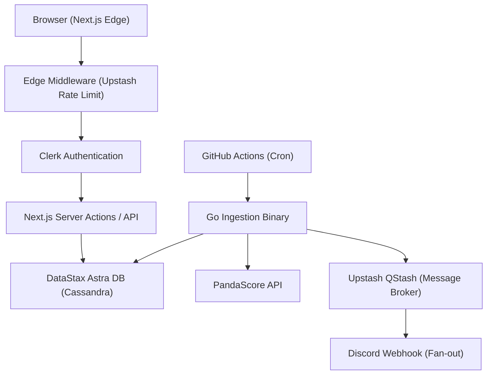

# 🏗️ Gamify Pipeline — System Architecture
**Edge Routing · Zero-Maintenance Syncing · Async Webhooks · Distributed Auth**

---

## 📌 Overview

**Gamify Pipeline** is a real-time esports match tracking system built to be completely serverless and highly resilient. The architecture is split into a **Go-based background ingestion worker** and a **Next.js edge-rendered frontend**.

---

## 🚀 Architecture Diagram

---

## 🔁 Dual-Tier Processing

### 1️⃣ Background Ingestion (Go)
**Status:** ✅ Implemented

- **Trigger:** GitHub Actions cron job.
- **Logic:** Fetches latest matches from PandaScore, calculates deltas (Insert/Update), and commits to Astra DB.
- **Fan-out:** Routes notifications for active matches directly to Discord using Upstash QStash.

### 2️⃣ Edge Frontend (Next.js)
**Status:** ✅ Implemented

- **Trigger:** User Navigation.
- **Logic:** Server-side fetches data directly from Astra DB using Server Components. Edge Middleware blocks malicious traffic via Upstash Redis Rate Limiting.

---

## 🗄️ Core Infrastructure

| Responsibility | Technology |
|---------------|------------|
| Authentication & Tenants | Clerk |
| Core Database | DataStax Astra DB |
| Ingestion & Processing | Go + GitHub Actions |
| Frontend & API Routing | Next.js on Vercel |
| Event Fan-out & Retries | Upstash QStash |
| Edge Rate Limiting | Upstash Redis |

> Each system component is entirely serverless, resulting in near-zero idle infrastructure costs.
